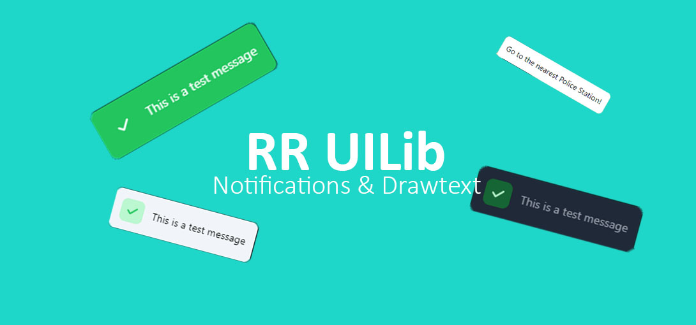
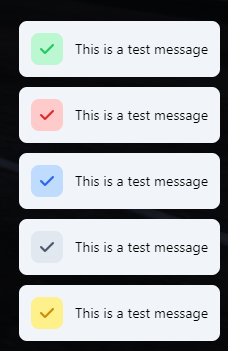
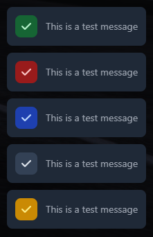
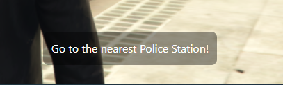
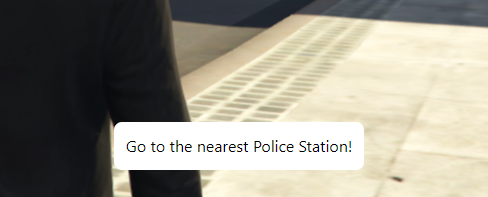
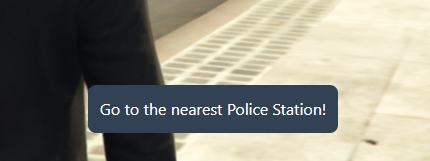

<div align='center'><h3><a href="https://discord.gg/RsWzxwtAY3">Discord</a></h3></div>

<br>

# **RR UILib - The UI framework for your fivem server**

This is a new and improved UI resource that is more customizable then my old resource rr_notify. And it also does not only create notification, you can also draw text that stays on the screen until you disable it.

## **Warning !!!!**

If you want this resource to be plug and play please download the newst version from releases. The code here is the source code and should only be used for development purposes

<br>

## **Features**

This script currently has 2 ui components.

1. Notify | Notifications
2. DrawText

The notifications come with a wide variaty of options so you can change everything to your liking.

### **Notifications**

<br>

#### **How to use:**

Through exports:

```lua
exports.rr_uilib:Notify(data)
```

Through event:

```lua
TriggerClientEvent("rr_uilib:Notify", source, data)
```

#### **Properties:**

The properties are send through the data object. This data object can contain the following options:

**Message**

```lua
local data = {
  msg = "This is a test message" -- Required
}
```

**Style**
The default option is a white background with the icon colored

```lua
local data = {
  style = "default"
}
```

Options: `"default", "dark", "colored"`

**Default**  
  
**Dark**  
  
**Colored**  


**Type**
As you can see on the images above, all the types are displayed. The order of the options below is the same as visible on the images. This will give you an idea how the different types look.

```lua
local data = {
  type = "default"
}
```

Options: `"success", "error", "primary", "default", "warning`

**Icon**
The icon uses the [fontawesome 6.0.0](https://fontawesome.com/icons) free icons. You just have to add the classes of the icon you want into the icon option.

```lua
local data = {
  icon = "fa-solid fa-vial"
}
```

**Position**

```lua
local data = {
  position = "top-right"
}
```

Options: `"top-left", "top-center", "top-right", "bottom-left", "bottom-center", "bottom-right"`
**Duration**

```lua
local data = {
  duration = 1000 -- Time in milliseconds
}
```

### **DrawText**

<br>

#### **How to use:**

Through exports:

```lua
exports.rr_uilib:DrawText(data)
```

Through event:

```lua
TriggerClientEvent("rr_uilib:DrawText", source, data)
```

**Message**

```lua
local data = {
  msg = "This is a test message" -- Required
}
```

**Draw**

```lua
local data = {
  draw = true -- Required
}
```

If you want to disable the text you have drawn you can simply do that by triggering the DrawText function and just sending data.draw as false.

Like this

```lua
exports.rr_uilib:DrawText({draw = false})
```

**Position**

```lua
local data = {
  position = "top-right"
}
```

Options: `"top-left", "top-center", "top-right", "bottom-left", "bottom-center", "bottom-right", "middle-left", "middle-center", "middle-right"`

**Style**

```lua
local data = {
  style = "transparant"
}
```

Options: `"white", "dark", "transparant"`
**Transparant**  
  
**White**  
  
**Dark**  


### **Questions**

I hope this resource will be helpfull. If you have any question on how to use it please join my support discord so that I can help you.

# License

rr_uilib
Copyright (c) 2022 RoleplayRevisited

Permission is hereby granted, free of charge, to any person obtaining a copy
of this software and associated documentation files (the "Software"), to deal
in the Software without restriction, including without limitation the rights
to use, copy, modify, merge, publish, distribute, sublicense, and/or sell
copies of the Software, and to permit persons to whom the Software is
furnished to do so, subject to the following conditions:

The above copyright notice and this permission notice shall be included in all
copies or substantial portions of the Software.

THE SOFTWARE IS PROVIDED "AS IS", WITHOUT WARRANTY OF ANY KIND, EXPRESS OR
IMPLIED, INCLUDING BUT NOT LIMITED TO THE WARRANTIES OF MERCHANTABILITY,
FITNESS FOR A PARTICULAR PURPOSE AND NONINFRINGEMENT. IN NO EVENT SHALL THE
AUTHORS OR COPYRIGHT HOLDERS BE LIABLE FOR ANY CLAIM, DAMAGES OR OTHER
LIABILITY, WHETHER IN AN ACTION OF CONTRACT, TORT OR OTHERWISE, ARISING FROM,
OUT OF OR IN CONNECTION WITH THE SOFTWARE OR THE USE OR OTHER DEALINGS IN THE
SOFTWARE.
